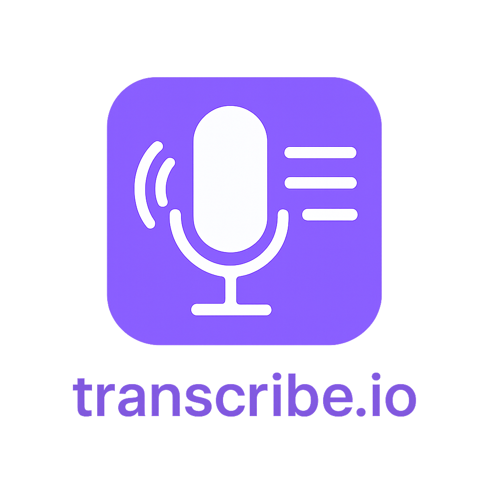

  

**transcribe.io** is a cross-platform audio transcription app built with 
.NET MAUI and C#. It enables users to record audio and transcribe them using on-device machine learning models.

## Features

- Record audio directly from your microphone
- Transcribe recorded audio and show transcription result
- Real-time transcription mode (live display of recognized text)
- Model selection and management (download and switch between models)

## Tech Stack

- **.NET MAUI** for cross-platform deployment (iOS, Android)
- **C#** for application logic
- Local ML model inference using Whisper.cpp for audio transcription

## Getting Started

1. Clone the repository.
2. Open the solution in your preferred IDE (e.g., JetBrains Rider, Visual Studio).
3. Build and run the app.

## Disclaimers

*Currently, only iOS is supported. Android support is a WIP.*

*This project is a work in progress and welcomes contributions!*

## TODOs
- [x] Implement basic UI with on-device transcription support
- [x] Add support for real-time transcription
- [x] Support downloading and running different Whisper models
- [x] Add iOS deployment support
- [ ] Improve accuracy on real-time transcriptions
- [ ] Add Android deployment support
- [ ] Configure CI/CD for automated builds

## Acknowledgements

I want to acknowledge [DIPS AS](https://www.dips.com/) for giving me the opportunity to develop this open-source software.  

This project was heavily inspired by [MauiWhisper](https://github.com/drasticactions/MauiWhisper). 
Real-time transcription was based on the work of [whisper_streaming](https://github.com/ufal/whisper_streaming).
